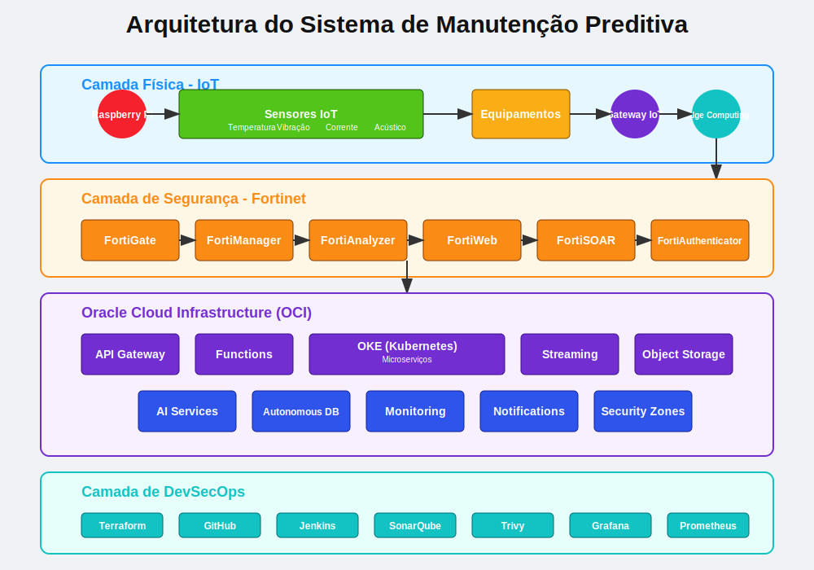
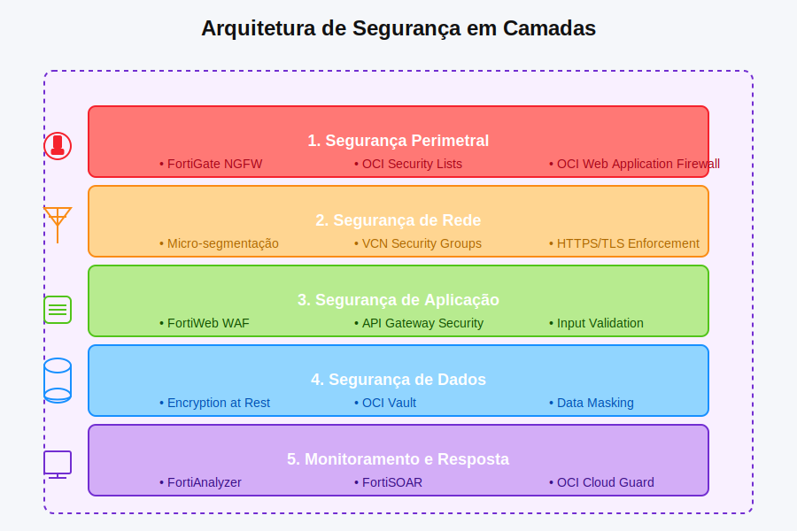
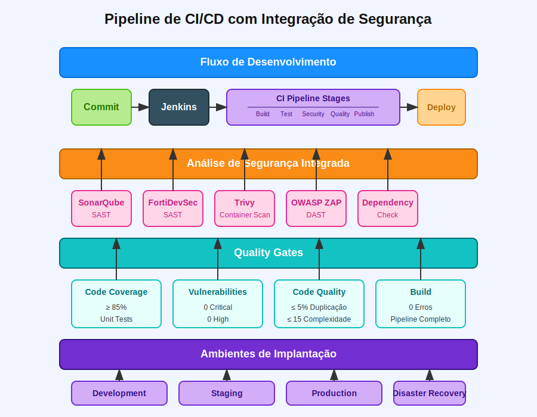
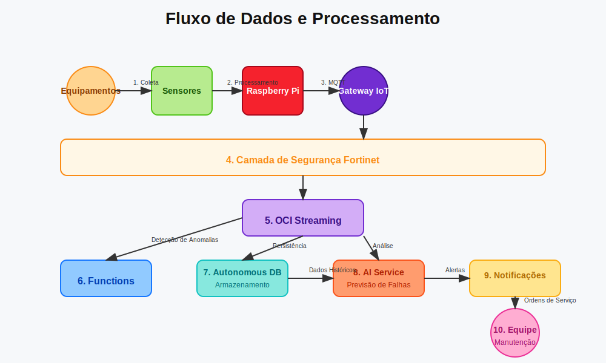
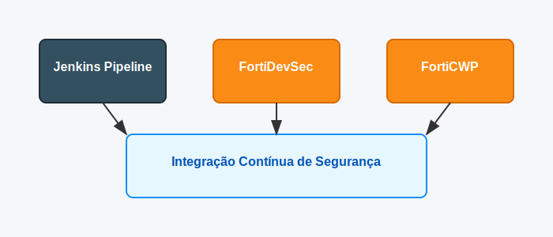
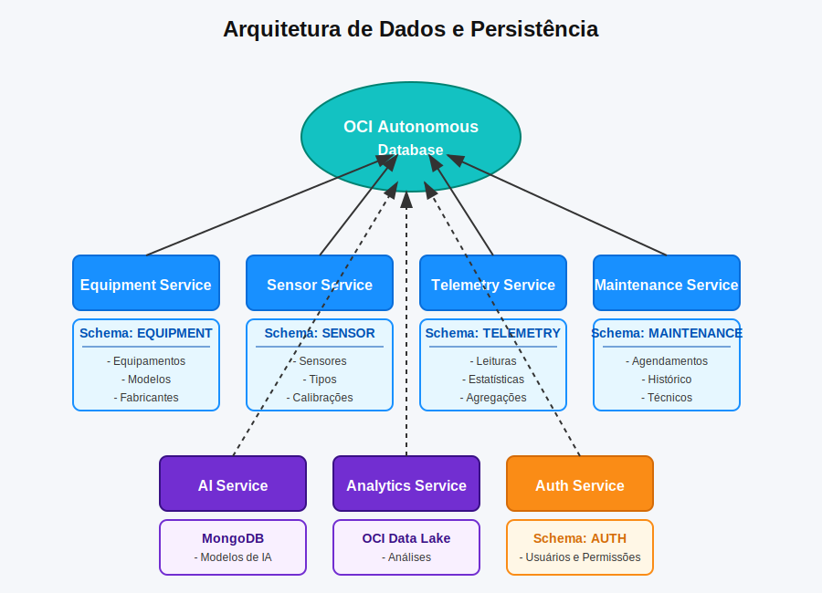
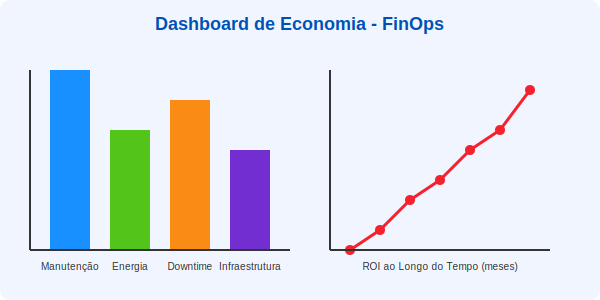

AetherAI × Fortinet Cloud Security Challenge
============================================

Sistema inteligente de manutenção preditiva industrial com segurança avançada Fortinet na Oracle Cloud

🌟 Visão Geral
O Sistema de Manutenção Preditiva Industrial é uma solução completa que combina IoT, computação em nuvem e inteligência artificial para prever falhas em equipamentos antes que ocorram. Desenvolvido como parte do Challenge de Segurança Cloud - uma parceria entre AetherAI e Fortinet - o sistema apresenta uma arquitetura robusta e segura implementada na Oracle Cloud Infrastructure (OCI).
🎯 Transformando a manutenção industrial

[](https://jenkins.aetherai.com/job/fortinet-challenge/)
[](https://sonar.aetherai.com/dashboard?id=aetherAI-fortinet-challenge)
[](LICENSE)
[](https://www.oracle.com/cloud/)
[](https://www.fortinet.com/)
[](https://github.com/aetherAI/fortinet-challenge/releases)

### Diagrama de Arquitetura




```bash
# Clonar o repositório
git clone https://github.com/aetherAI/fortinet-challenge.git
cd fortinet-challenge

# Configurar credenciais OCI (necessário ter OCI CLI instalado)
oci setup config

# Implantar infraestrutura base
cd terraform/environments/dev
terraform init && terraform apply

# Implantar aplicação
cd ../../..
./scripts/setup/deploy-dev.sh
```

### Referência da API

Documentação completa das APIs está disponível nos seguintes formatos:
- Os exemplos de uso estarão na sessão de tecnologias.

- **Swagger UI**: Disponível em `https://api.aetherai.com/docs` quando o sistema está em execução
- **OpenAPI Spec**: Disponível em `docs/api/openapi.yaml`
- **Postman Collection**: Disponível em `docs/api/aetherAI-fortinet-challenge.postman_collection.json`

### Solução

Nossa solução implementa manutenção preditiva baseada em dados e IA para:
- Monitorar equipamentos continuamente através de sensores IoT
- Analisar padrões e detectar anomalias que precedem falhas
- Prever problemas com antecedência suficiente para agendamento otimizado de manutenção
- Aumentar a vida útil dos equipamentos e reduzir downtime não planejado
- Fornecer insights acionáveis para equipes de manutenção

Tudo isso dentro de uma arquitetura segura que integra as soluções de segurança Fortinet com os recursos nativos da Oracle Cloud.

### Benefícios

- **Redução de Custos**: Diminuição de 30-50% nos custos de manutenção através da otimização dos ciclos de reparo
- **Aumento de Disponibilidade**: Redução de 70-90% em downtime não planejado
- **Extensão de Vida Útil**: Aumento de 20-40% na vida útil dos equipamentos
- **Segurança Robusta**: Proteção completa da coleta de dados até o processamento na nuvem
- **Otimização de Recursos**: Planejamento eficiente de equipes e peças de reposição
- **Inteligência Acionável**: Dashboards e alertas que convertem dados em ações concretas

### Casos de Uso

A solução foi projetada para diversos ambientes industriais, incluindo:
- Instalações de processamento e fabricação
- Plantas de tratamento de água e esgoto
- Instalações de geração e distribuição de energia
- Operações de mineração e extração
- Indústria de óleo e gás

## Arquitetura

A arquitetura do sistema é composta por quatro camadas principais que trabalham de forma integrada:

### Camadas do Sistema



#### 1. Camada Física (IoT)

A camada física é responsável pela coleta de dados dos equipamentos industriais através de sensores conectados a um Raspberry Pi, que funciona como controlador local.

**Componentes:**
- **Raspberry Pi 4**: Controlador central que coleta, processa inicialmente e transmite os dados
- **Sensores Industriais**: Monitoram diversos parâmetros dos equipamentos (detalhados na seção de componentes)
- **Gateway IoT**: Conecta os dispositivos edge à infraestrutura de nuvem
- **Edge Computing**: Processamento local para redução de latência e tráfego

#### 2. Camada de Segurança (Fortinet)

A camada de segurança Fortinet fornece proteção completa para todo o fluxo de dados e infraestrutura do sistema.

**Componentes:**
- **FortiGate**: Firewall NGFW para proteção perimetral e segmentação de rede
- **FortiWeb**: WAF (Web Application Firewall) para proteção das APIs
- **FortiManager**: Gestão centralizada de dispositivos e políticas Fortinet
- **FortiAnalyzer**: Agregação de logs, análise de segurança e conformidade
- **FortiSOAR**: Orquestração e automação de resposta a incidentes
- **FortiAuthenticator**: Gestão de identidade e autenticação multifator

#### 3. Camada de Nuvem (OCI)

A Oracle Cloud Infrastructure fornece a plataforma para processamento, armazenamento e análise dos dados coletados.

**Componentes:**
- **OKE (Kubernetes)**: Orquestração de contêineres para os microserviços
- **Functions**: Processamento serverless para eventos e transformações
- **API Gateway**: Gerenciamento e exposição segura das APIs
- **Streaming**: Ingestão e processamento de fluxos de dados em tempo real
- **Object Storage**: Armazenamento de dados não estruturados (históricos, backups)
- **Autonomous Database**: Armazenamento principal de dados estruturados
- **AI Services**: Serviços de ML para análise preditiva

#### 4. Camada de DevSecOps



A camada de DevSecOps garante desenvolvimento, integração, entrega e monitoramento contínuos e seguros.

**Componentes:**
- **Terraform**: Infraestrutura como código (IaC)
- **GitHub**: Controle de versão e colaboração
- **Jenkins**: Automação de CI/CD
- **SonarQube**: Análise de qualidade de código
- **Trivy**: Escaneamento de vulnerabilidades
- **Grafana**: Visualização de métricas e monitoramento

### Fluxo de Dados



1. Sensores coletam dados de equipamentos industriais (temperatura, vibração, corrente, etc.)
2. Raspberry Pi processa localmente e envia via MQTT para o Gateway IoT
3. Dados atravessam a camada de segurança Fortinet
4. OCI Streaming ingere dados em tempo real
5. Funções processam dados para detecção de anomalias
6. Dados são armazenados no Autonomous Database
7. Algoritmos de IA analisam padrões para previsão de falhas
8. APIs expõem resultados para aplicações e dashboards
9. Sistema de notificação alerta sobre possíveis falhas
10. Equipe de manutenção recebe ordens de serviço preventivas

### Integração de Segurança


A integração entre as soluções Fortinet e os recursos nativos de segurança da OCI cria múltiplas camadas de proteção:

1. **Perímetro Externo**: FortiGate NGFW protege todo o tráfego de entrada e saída
2. **Zona DMZ**: FortiWeb WAF protege APIs e aplicações web
3. **Segurança Interna**: Micro-segmentação e proteção de tráfego leste-oeste
4. **Proteção de Dados**: Criptografia, controle de acesso e mascaramento
5. **Monitoramento**: Detecção e resposta a ameaças em tempo real

## 🔒 Segurança de Software

A segurança é um pilar fundamental deste projeto, seguindo o princípio de "Security by Design" em todas as etapas do desenvolvimento. Implementamos uma estratégia abrangente que vai além das práticas tradicionais.

### Análise Estática de Código Contínua


Cada linha de código passa por rigorosa análise estática utilizando:

- **SonarQube Enterprise**: Varredura completa com regras personalizadas para detecção de:
  - Vulnerabilidades OWASP Top 10
  - Code smells e débitos técnicos
  - Bugs de segurança em TypeScript e Python
  - Complexidade ciclomática excessiva
  - Anti-padrões de segurança

- **Fortify Static Code Analyzer**: Análise profunda de fluxo de dados para identificar:
  - Vulnerabilidades de injeção (SQL, NoSQL, comandos)
  - Vazamentos de informações sensíveis
  - Configurações inseguras
  - Fraquezas criptográficas

- **Checkmarx SAST**: Varredura complementar focada em:
  - Vulnerabilidades específicas de frameworks (NestJS, FastAPI)
  - Falhas em bibliotecas de terceiros
  - Cross-Site Scripting (XSS) e Cross-Site Request Forgery (CSRF)

### Pipeline de Segurança Contínua

Integração robusta entre Jenkins e ferramentas de segurança Fortinet:

- **Quality Gates Rigorosos**: Build falha automaticamente se:
  - Vulnerabilidades críticas ou altas forem detectadas
  - Cobertura de testes cair abaixo de 85%
  - Novas dívidas técnicas excederem limites estabelecidos

- **Revisão de Dependências**: Verificação automática com:
  - OWASP Dependency Check
  - Snyk Vulnerability Scanner
  - Renovate Bot para atualizações proativas

- **Verificação de Segredos**: Prevenção contra vazamento de credenciais com:
  - GitLeaks pre-commit
  - TruffleHog em verificações CI
  - HashiCorp Vault para gestão de segredos

### Testes de Segurança Automatizados

Bateria completa de testes focados em segurança:

- **DAST (Dynamic Application Security Testing)**: 
  - OWASP ZAP integrado ao CI/CD
  - Burp Suite Enterprise para testes agendados

- **Testes de Pentest Automatizados**:
  - Nuclei com templates personalizados
  - Testes de fuzzing para APIs

- **Container Security**:
  - Trivy para scan de imagens
  - Falco para monitoramento de runtime
  - Anchore Engine para políticas de compliance

## 🛡️ Integração Fortinet-DevSecOps



Nossa arquitetura implementa uma integração pioneira entre as ferramentas de CI/CD e a suite de segurança Fortinet, criando um ecossistema de DevSecOps verdadeiramente integrado.

### FortiDevSec + Jenkins

Desenvolvemos uma integração customizada entre Jenkins e FortiDevSec para segurança de aplicações nativa de cloud:

- **Plugins Jenkins Personalizados**:
  - Escaneamento de código com FortiDevSec SAST antes de cada merge
  - Dashboard unificado de vulnerabilidades dentro do Jenkins
  - Classificação automática de severidade de falhas

- **Webhooks Bidirecionais**:
  - Notificação automática de vulnerabilidades no Slack/MS Teams
  - Criação de tickets Jira para vulnerabilidades críticas
  - Bloqueio inteligente de merge baseado em políticas de segurança

- **Relatórios Consolidados**:
  - Agregação de resultados de segurança de múltiplas ferramentas
  - Histórico de melhorias de segurança ao longo do tempo
  - Conformidade com benchmarks de segurança (OWASP, CIS, NIST)

### FortiCWP para Segurança Cloud

Integramos FortiCWP (Cloud Workload Protection) para garantir a segurança dos recursos na OCI:

- **Monitoramento de Configuração Cloud**:
  - Verificação contínua de configurações da OCI contra CIS Benchmarks
  - Alertas para desvios de políticas de segurança
  - Remediação automática para violações de menor risco

- **Proteção de Workloads em Runtime**:
  - Monitoramento comportamental de containers e VMs
  - Detecção de atividades suspeitas em tempo real
  - Integração com FortiSOAR para resposta a incidentes

- **Gerenciamento de Postura de Segurança**:
  - Painel único de visibilidade para recursos OCI
  - Auditoria de conformidade automatizada
  - Avaliação contínua de riscos com pontuação de segurança

### FortiSIEM para Monitoramento

Implementamos FortiSIEM para correlacionar eventos de segurança em todo o ambiente:

- **Coleta Centralizada de Logs**:
  - Agregação de logs de aplicações, infraestrutura e segurança
  - Normalização e enriquecimento de dados
  - Arquivamento seguro para análise forense

- **Detecção Avançada de Ameaças**:
  - Correlação de eventos com base em ML
  - Detecção de anomalias comportamentais
  - Alerta e resposta automatizada para incidentes

- **Integração com SOC**:
  - Dashboards customizados para equipe de segurança
  - Fluxos de trabalho para investigação de incidentes
  - Rastreamento de KPIs de segurança

## Tecnologias


### Estrutura de Diretórios

```
aetherAI-fortinet-challenge/
├── terraform/                           # Infraestrutura como código
│   ├── modules/                         # Módulos reutilizáveis
│   │   ├── network/                     # Recursos de rede (VCN, subnets)
│   │   ├── compute/                     # Recursos de computação (OKE, VMs)
│   │   ├── database/                    # Recursos de banco de dados
│   │   ├── security/                    # Recursos de segurança
│   │   └── monitoring/                  # Recursos de monitoramento
│   ├── environments/                    # Configurações por ambiente
│   │   ├── dev/                         # Ambiente de desenvolvimento
│   │   ├── staging/                     # Ambiente de homologação
│   │   └── prod/                        # Ambiente de produção
│   └── scripts/                         # Scripts auxiliares para Terraform
│
├── microservices/                       # Microserviços (Clean Architecture)
│   ├── equipment-service/               # Serviço de gerenciamento de equipamentos
│   │   ├── src/
│   │   │   ├── domain/                  # Camada de domínio (Clean Architecture)
│   │   │   │   ├── entities/            # Entidades de negócio
│   │   │   │   ├── value-objects/       # Objetos de valor
│   │   │   │   ├── repositories/        # Interfaces de repositórios
│   │   │   │   ├── services/            # Serviços de domínio
│   │   │   │   └── events/              # Eventos de domínio
│   │   │   │
│   │   │   ├── application/             # Camada de aplicação
│   │   │   │   ├── use-cases/           # Casos de uso
│   │   │   │   ├── dtos/                # Data Transfer Objects
│   │   │   │   ├── exceptions/          # Exceções da aplicação
│   │   │   │   ├── interfaces/          # Interfaces de serviços externos
│   │   │   │   └── validators/          # Validadores
│   │   │   │
│   │   │   ├── infrastructure/          # Camada de infraestrutura
│   │   │   │   ├── database/            # Implementação de persistência
│   │   │   │   │   ├── repositories/    # Implementações de repositórios
│   │   │   │   │   ├── models/          # Modelos ORM
│   │   │   │   │   └── migrations/      # Migrações de banco de dados
│   │   │   │   ├── external/            # Integrações externas
│   │   │   │   │   ├── clients/         # Clientes HTTP 
│   │   │   │   │   └── adapters/        # Adaptadores para serviços externos
│   │   │   │   ├── messaging/           # Implementação de mensageria
│   │   │   │   │   ├── publishers/      # Publicadores de eventos
│   │   │   │   │   └── subscribers/     # Consumidores de eventos
│   │   │   │   └── security/            # Implementações de segurança
│   │   │   │
│   │   │   └── presentation/            # Camada de apresentação
│   │   │       ├── controllers/         # Controladores de API
│   │   │       ├── middlewares/         # Middlewares
│   │   │       ├── validators/          # Validadores de entrada
│   │   │       ├── views/               # Transformadores de resposta
│   │   │       └── routes/              # Definição de rotas
│   │   │
│   │   ├── tests/                       # Testes
│   │   │   ├── unit/                    # Testes unitários
│   │   │   ├── integration/             # Testes de integração
│   │   │   └── e2e/                     # Testes end-to-end
│   │   │
│   │   ├── config/                      # Configurações
│   │   ├── Dockerfile                   # Configuração do container
│   │   └── package.json                 # Dependências
│   │
│   ├── sensor-service/                  # Serviço de gerenciamento de sensores
│   │   └── ... (mesma estrutura da Clean Architecture)
│   │
│   ├── maintenance-service/             # Serviço de manutenção
│   │   └── ... (mesma estrutura da Clean Architecture)
│   │
│   ├── telemetry-service/               # Processamento de telemetria
│   │   └── ... (mesma estrutura da Clean Architecture)
│   │
│   ├── analytics-service/               # Análise de dados (Python)
│   │   ├── src/
│   │   │   ├── domain/                  # Camada de domínio
│   │   │   ├── application/             # Camada de aplicação
│   │   │   ├── infrastructure/          # Camada de infraestrutura
│   │   │   └── presentation/            # Camada de apresentação (FastAPI)
│   │   └── ... (restante da estrutura)
│   │
│   ├── ai-service/                      # Serviço de IA preditiva (Python)
│   │   └── ... (estrutura similar ao analytics-service)
│   │
│   ├── notification-service/            # Serviço de notificações
│   │   └── ... (mesma estrutura da Clean Architecture)
│   │
│   └── auth-service/                    # Serviço de autenticação
│       └── ... (mesma estrutura da Clean Architecture)
│
├── lambdas/                             # Funções serverless (OCI Functions)
│   ├── data-transformation/             # Transformação de dados
│   │   ├── src/                         # Código-fonte
│   │   ├── test/                        # Testes
│   │   └── func.yaml                    # Configuração da função
│   ├── anomaly-detection/               # Detecção de anomalias
│   └── alert-trigger/                   # Gatilho de alertas
│
├── iot/                                 # Código para dispositivos IoT
│   └── raspberry-pi/                    # Código para Raspberry Pi
│       ├── src/                         # Código-fonte
│       │   ├── sensors/                 # Drivers para sensores
│       │   ├── mqtt/                    # Cliente MQTT
│       │   ├── processing/              # Processamento local
│       │   └── utils/                   # Utilitários
│       ├── tests/                       # Testes
│       ├── config/                      # Arquivos de configuração
│       └── requirements.txt             # Dependências Python
│
├── frontend/                            # Interface web (planejado)
│   ├── src/                             # Código-fonte
│   │   ├── components/                  # Componentes React
│   │   ├── pages/                       # Páginas da aplicação
│   │   ├── services/                    # Serviços e APIs
│   │   ├── hooks/                       # React hooks customizados
│   │   └── utils/                       # Utilitários
│   ├── public/                          # Arquivos estáticos
│   └── Dockerfile                       # Configuração do container
│
├── security/                            # Configurações e políticas de segurança
│   ├── fortinet/                        # Configurações específicas do Fortinet
│   │   ├── fortigate/                   # Configurações do FortiGate
│   │   ├── fortiweb/                    # Configurações do FortiWeb
│   │   └── fortisoar/                   # Configurações do FortiSOAR
│   ├── policies/                        # Políticas de segurança
│   └── scripts/                         # Scripts de segurança
│
├── cicd/                                # Configurações de CI/CD
│   ├── jenkins/                         # Pipelines Jenkins
│   │   ├── Jenkinsfile.build            # Pipeline de build
│   │   ├── Jenkinsfile.security         # Pipeline de análise de segurança
│   │   └── Jenkinsfile.deploy           # Pipeline de deploy
│   ├── github-actions/                  # Workflows do GitHub Actions
│   ├── sonarqube/                       # Configurações SonarQube
│   │   ├── quality-profiles/            # Perfis de qualidade
│   │   └── quality-gates/               # Gates de qualidade
│   └── trivy/                           # Configurações do Trivy
│
├── k8s/                                 # Configurações Kubernetes
│   ├── base/                            # Recursos base
│   │   ├── deployments/                 # Deployments base
│   │   ├── services/                    # Serviços base
│   │   └── config-maps/                 # ConfigMaps base
│   └── overlays/                        # Configurações por ambiente
│       ├── dev/                         # Ambiente de desenvolvimento
│       ├── staging/                     # Ambiente de homologação
│       └── prod/                        # Ambiente de produção
│
├── docs/                                # Documentação
│   ├── architecture/                    # Diagramas e documentos de arquitetura
│   ├── api/                             # Documentação de API (OpenAPI/Swagger)
│   ├── security/                        # Documentação de segurança
│   ├── finops/                          # Documentação de FinOps e custos
│   └── operation/                       # Guias operacionais
│
├── monitoring/                          # Configurações de monitoramento
│   ├── grafana/                         # Dashboards Grafana
│   ├── prometheus/                      # Configurações Prometheus
│   └── alerts/                          # Configurações de alertas
│
├── scripts/                             # Scripts auxiliares
│   ├── setup/                           # Scripts de configuração
│   ├── deployment/                      # Scripts de implantação
│   └── maintenance/                     # Scripts de manutenção
│
├── .github/                             # Configurações GitHub
├── .gitignore                           # Arquivos ignorados pelo Git
├── README.md                            # Este arquivo
└── LICENSE                              # Licença do projeto
```

- **Linguagens**:
  - **TypeScript/Node.js**: APIs RESTful, microserviços de telemetria e notificação
  - **Python**: Serviços de análise de dados, IA e processamento de sinais

- **Frameworks**:
  - **NestJS**: Framework TypeScript para APIs e microserviços 
  - **NestJS**: Framework TypeScript para o Frontend
  - **FastAPI**: Framework Python de alta performance para serviços de IA
  - **TensorFlow/PyTorch**: Bibliotecas para modelos de IA
  - **scikit-learn**: Algoritmos de ML para análise de dados

- **Banco de Dados**:
  - **Oracle Autonomous Database**: Armazenamento principal e análise de dados
  - **Redis**: Caching e filas de mensagens

#### Requisitos Locais
1. Node.js 16+
2. Python 3.9+
3. Docker e Docker Compose
4. kubectl, OCI CLI, Terraform

### Frontend (Planejado)

- **NextJS**: Interface de usuário moderna e responsiva
- **Recharts**: Visualização de dados e dashboards
- **TailwindCSS**: Componentes de interface consistentes

### DevOps

- **Terraform**: Infraestrutura como código
- **GitHub**: Controle de versão com GitFlow
- **Jenkins**: Automação de CI/CD
- **SonarQube**: Análise de qualidade de código
- **Trivy**: Escaneamento de vulnerabilidades
- **Grafana**: Monitoramento e dashboards

### Segurança

- **FortiGate**: Next-Generation Firewall
- **FortiWeb**: Web Application Firewall
- **FortiManager**: Gerenciamento centralizado
- **FortiAnalyzer**: Análise de logs e relatórios
- **FortiSOAR**: Orquestração e resposta a incidentes
- **FortiAuthenticator**: Identidade e autenticação

### Infraestrutura Cloud (OCI)

- **OKE (Kubernetes)**: Orquestração de containers para microsserviços
- **Functions**: Serverless para processamento de eventos
- **Streaming**: Ingestão e processamento de dados em tempo real
- **Object Storage**: Armazenamento de dados não estruturados
- **API Gateway**: Exposição e gestão de APIs
- **Autonomous Database**: Banco de dados gerenciado
- **Security Zones**: Políticas de segurança unificadas

Bancos de Dados para Microserviços
==================================

A arquitetura do sistema utiliza uma abordagem de "Database per Service" (banco de dados por serviço), seguindo as melhores práticas para microserviços. Cada serviço possui seu próprio banco de dados, garantindo isolamento de dados, escalabilidade independente e evitando acoplamentos indesejados.



Visão Geral dos Bancos de Dados
-------------------------------

| Microserviço | Tipo de Banco | Tecnologia | Finalidade | Características Principais |
| --- | --- | --- | --- | --- |
| equipment-service | Relacional | Oracle Autonomous Database | Armazenamento de dados de equipamentos, modelos e configurações | - Alta disponibilidade<br>- Auto-tuning<br>- Backup automático |
| sensor-service | Relacional | Oracle Autonomous Database | Dados de sensores, calibrações e especificações técnicas | - Particionamento por tipo de sensor<br>- Cache integrado |
| maintenance-service | Relacional | Oracle Autonomous Database | Registros de manutenções, histórico e agendamentos | - Retention policies<br>- Auditoria completa de alterações |
| telemetry-service | Time Series | Oracle MySQL HeatWave | Dados de telemetria de alta frequência | - Otimização para séries temporais<br>- Compressão de dados<br>- Particionamento temporal |
| analytics-service | Híbrido | Oracle ADW + Object Storage | Dados processados e análises estatísticas | - In-database ML<br>- Processamento paralelo massivo |
| ai-service | Híbrido | Oracle ADW + Object Storage | Armazenamento de modelos e dados de treinamento | - Escalabilidade para cargas de ML<br>- Armazenamento de modelos versionados |
| notification-service | NoSQL | MongoDB Atlas | Configurações de alertas e histórico de notificações | - Esquema flexível<br>- Baixa latência |
| auth-service | Relacional | Oracle Autonomous Database | Usuários, papéis e permissões | - Encriptação avançada<br>- Row-level security |

Detalhamento dos Bancos de Dados
--------------------------------

### 1\. Equipment Service - Oracle Autonomous Database

O Equipment Service utiliza Oracle Autonomous Database (ATP) para armazenar informações estruturadas sobre equipamentos industriais.

**Principais tabelas:**

-   `equipments`: Registro principal de equipamentos
-   `equipment_models`: Modelos/tipos de equipamentos
-   `equipment_specifications`: Especificações técnicas
-   `equipment_locations`: Localização física dos equipamentos
-   `equipment_groups`: Agrupamentos lógicos de equipamentos

**Características específicas:**

-   Backups automáticos com retenção de 30 dias
-   Encriptação transparente de dados (TDE)
-   Configuração de alta disponibilidade (HA)
-   Aplicação de políticas automáticas de Resource Manager

### 2\. Sensor Service - Oracle Autonomous Database

Armazena informações sobre todos os sensores instalados nos equipamentos, incluindo configurações e calibrações.

**Principais tabelas:**

-   `sensors`: Registro principal de sensores
-   `sensor_types`: Tipos de sensores suportados
-   `sensor_calibrations`: Histórico de calibrações
-   `sensor_thresholds`: Limiares para alertas
-   `sensor_equipment_mapping`: Relacionamento entre sensores e equipamentos

**Características específicas:**

-   Particionamento por tipo de sensor para otimização de consultas
-   Políticas de data masking para dados sensíveis
-   Índices específicos para pesquisas por equipamento

### 3\. Maintenance Service - Oracle Autonomous Database

Gerencia todo o histórico e agendamento de manutenções, incluindo manutenções preventivas, preditivas e corretivas.

**Principais tabelas:**

-   `maintenance_records`: Histórico de manutenções realizadas
-   `maintenance_schedules`: Agendamentos de manutenções futuras
-   `maintenance_types`: Tipos de manutenção (preventiva, corretiva, etc.)
-   `maintenance_tasks`: Tarefas específicas de cada manutenção
-   `spare_parts`: Registro de peças de reposição utilizadas
-   `technicians`: Informações sobre técnicos responsáveis

**Características específicas:**

-   Auditoria completa para rastreabilidade de alterações
-   Políticas de retenção de dados conforme requisitos regulatórios
-   Integração com serviço de notificações para lembretes

### 4\. Telemetry Service - Oracle MySQL HeatWave

Armazena grandes volumes de dados de telemetria coletados em alta frequência pelos sensores IoT.

**Principais tabelas:**

-   `telemetry_data`: Leituras de sensores
-   `telemetry_aggregated_hourly`: Dados agregados por hora
-   `telemetry_aggregated_daily`: Dados agregados por dia
-   `telemetry_metadata`: Metadados associados às leituras

**Características específicas:**

-   Otimização específica para séries temporais
-   Particionamento temporal (por dia/mês)
-   Políticas automáticas de compressão e arquivamento
-   Capacidade de processamento in-memory com HeatWave
-   TTL (Time-to-live) configurável para dados antigos

### 5\. Analytics Service - Oracle ADW + Object Storage

Utiliza uma combinação de banco de dados analítico (ADW) para processamento e Object Storage para dados não estruturados e históricos.

**Estrutura no ADW:**

-   `data_analysis_results`: Resultados de análises estatísticas
-   `kpi_metrics`: Indicadores-chave de performance
-   `correlation_analysis`: Correlações entre diferentes métricas
-   `trend_analysis`: Análises de tendências

**Estrutura no Object Storage:**

-   `/analytics/reports/`: Relatórios gerados em PDF/CSV
-   `/analytics/datasets/`: Conjuntos de dados para análises
-   `/analytics/exports/`: Exportações para sistemas externos

**Características específicas:**

-   Machine Learning integrado ao banco de dados
-   Capacidade de processamento paralelo massivo
-   Integração com ferramentas de análise (Jupyter, RStudio)

### 6\. AI Service - Oracle ADW + Object Storage

Gerencia modelos de IA, dados de treinamento e resultados de previsões.

**Estrutura no ADW:**

-   `prediction_models`: Registro de modelos disponíveis
-   `model_versions`: Versões de cada modelo
-   `model_training_history`: Histórico de treinamentos
-   `prediction_results`: Resultados de previsões
-   `feature_importance`: Importância de features por modelo

**Estrutura no Object Storage:**

-   `/models/binary/`: Modelos serializados por versão
-   `/models/training-data/`: Dados de treinamento
-   `/models/evaluation/`: Resultados de avaliação de modelos

**Características específicas:**

-   Versionamento de modelos
-   Rastreabilidade de treinamento
-   Avaliação automática de performance
-   Recursos para explicabilidade de modelos (XAI)

### 7\. Notification Service - MongoDB Atlas

Utiliza MongoDB para armazenar configurações flexíveis de alertas e histórico de notificações.

**Principais collections:**

-   `notification_templates`: Templates de mensagens
-   `notification_channels`: Canais de notificação (email, SMS, webhook)
-   `notification_rules`: Regras para geração de alertas
-   `notification_history`: Histórico de notificações enviadas
-   `user_preferences`: Preferências de notificação por usuário

**Características específicas:**

-   Esquema flexível para diferentes tipos de notificações
-   Baixa latência para consultas e inserções
-   Replicação para garantir alta disponibilidade
-   TTL para expirar automaticamente registros antigos

### 8\. Auth Service - Oracle Autonomous Database

Gerencia autenticação, autorização e controle de acesso.

**Principais tabelas:**

-   `users`: Informações de usuários
-   `roles`: Papéis no sistema
-   `permissions`: Permissões granulares
-   `role_permissions`: Relacionamento entre papéis e permissões
-   `user_roles`: Relacionamento entre usuários e papéis
-   `access_tokens`: Tokens de acesso
-   `audit_logs`: Logs de acesso e alterações

**Características específicas:**

-   Encriptação de dados sensíveis (senhas, tokens)
-   Row-level security para isolamento de dados
-   Auditoria completa de acessos
-   Integração com sistema de Single Sign-On (SSO)

Estratégias de Integração de Dados
----------------------------------

Embora cada microserviço tenha seu próprio banco de dados, a integração de dados entre eles é realizada através de:

1.  **Comunicação Assíncrona**:
    -   Sistema de mensageria baseado em eventos
    -   Oracle Stream Analytics para processamento de eventos complexos
    -   Padrão de Saga para transações distribuídas
2.  **API Gateway**:
    -   Agregação de dados de múltiplos serviços quando necessário
    -   Composição de APIs para interfaces de usuário
3.  **CQRS (Command Query Responsibility Segregation)**:
    -   Modelos de escrita otimizados para cada serviço
    -   Visualizações denormalizadas para consultas complexas
4.  **Replicação Seletiva**:
    -   Replicação somente das informações essenciais entre serviços
    -   Eventual consistency onde aplicável

Considerações de FinOps
-----------------------

A escolha e configuração dos bancos de dados consideram aspectos de otimização de custos:

-   **Escalabilidade Automática**: Todos os bancos escalam automaticamente, evitando sobreprovisionamento
-   **Hibernação**: Ambientes não-produtivos podem ser hibernados automaticamente
-   **Consolidação Seletiva**: Ambientes de desenvolvimento e testes utilizam instâncias compartilhadas
-   **Storage Tiering**: Arquivamento automático de dados históricos em camadas de armazenamento mais econômicas
-   **Performance Insights**: Monitoramento contínuo para otimização de queries e índices

Monitoramento e Segurança
-------------------------

Todos os bancos de dados implementam:

-   **Monitoramento Unificado**: Integração com Oracle Management Cloud
-   **Encriptação**: Dados encriptados em repouso e em trânsito
-   **Auditing**: Logs de auditoria enviados para OCI Logging
-   **IAM**: Integração com OCI Identity and Access Management
-   **Masking**: Data masking automático para ambientes não-produtivos
-   **Backups**: Políticas de backup e recuperação automatizadas

Esta abordagem de bancos de dados por serviço proporciona isolamento adequado para cada componente do sistema, mantendo a flexibilidade para escolher a tecnologia mais adequada para cada caso de uso específico, enquanto preserva princípios de segurança, custo-eficiência e performance.

## Componentes

### Dispositivos IoT e Sensores


#### Controlador
- **Raspberry Pi 4 Model B (8GB RAM)**: Controlador central que coleta dados dos sensores
  - **Custo**: ~$75 USD
  - **Vantagens**: Excelente potência de processamento, ampla comunidade, múltiplas interfaces de comunicação

#### Sensores para Monitoramento (Custo-Benefício)

##### Temperatura
- **DS18B20**: Sensor digital de temperatura resistente à água
  - **Custo**: ~$2-4 USD
  - **Precisão**: ±0.5°C
  - **Range**: -55°C a +125°C
  - **Interface**: 1-Wire (digital)
  - **Vantagens**: Impermeável, alta precisão, endereçável (vários sensores em um único barramento)

##### Corrente Elétrica
- **SCT-013-030**: Sensor de corrente não invasivo (transformador de corrente)
  - **Custo**: ~$8-12 USD
  - **Range**: 0-30A
  - **Interface**: Analógica
  - **Vantagens**: Não invasivo (clamp-on), fácil instalação sem interromper o circuito

##### Vibração
- **MPU6050**: Acelerômetro e giroscópio 6-DOF
  - **Custo**: ~$3-5 USD
  - **Sensibilidade**: Configurável, ±2g até ±16g
  - **Interface**: I²C
  - **Vantagens**: Baixo custo, mede aceleração e rotação, processamento digital

##### Pressão
- **BMP280**: Sensor de pressão barométrica e temperatura
  - **Custo**: ~$2-4 USD
  - **Precisão**: ±1 hPa
  - **Range**: 300-1100 hPa
  - **Interface**: I²C/SPI
  - **Vantagens**: Alta precisão, baixo consumo, sensor de temperatura integrado

##### Acústico
- **MAX9814**: Amplificador de microfone com controle automático de ganho
  - **Custo**: ~$4-7 USD
  - **Interface**: Analógica
  - **Vantagens**: Controle automático de ganho, ideal para detectar anomalias sonoras em equipamentos

##### RPM/Rotação
- **LJ18A3-8-Z/BX**: Sensor de proximidade indutivo
  - **Custo**: ~$5-10 USD
  - **Range**: 8mm
  - **Interface**: Digital (NPN/PNP)
  - **Vantagens**: Robusto para ambientes industriais, alta precisão para contagem de rotações

##### Nível de Líquido
- **HC-SR04 (encapsulado)**: Sensor ultrassônico à prova d'água
  - **Custo**: ~$3-6 USD
  - **Range**: 2-400cm
  - **Interface**: Digital
  - **Vantagens**: Sem contato com o líquido, medição precisa, baixo custo

##### Qualidade de Óleo
- **Capacitivo Personalizado**: Sensor capacitivo para monitoramento de contaminação
  - **Custo**: ~$15-25 USD
  - **Interface**: Analógica
  - **Vantagens**: Detecção de contaminantes, monitoramento de degradação

#### Kit Completo
Um kit completo para monitorar uma bomba industrial típica incluiria:
- 2x DS18B20 (temperatura)
- 1x SCT-013-030 (corrente)
- 1x MPU6050 (vibração)
- 1x BMP280 (pressão)
- 1x MAX9814 (acústico)
- 1x LJ18A3-8-Z/BX (RPM)
- 1x HC-SR04 (nível)

**Custo total aproximado de sensores por equipamento**: $30-60 USD
**Custo total com Raspberry Pi**: $105-135 USD

### Componentes de Software

#### APIs Containers - (TypeScript/NestJS)
- **Equipment API**: Gestão de equipamentos e manutenções
- **Sensor API**: Gestão de sensores e telemetria
- **Maintenance API**: Agendamento e histórico de manutenções
- **Auth API**: Autenticação e autorização

#### Serviços de Processamento e Análise
- **Telemetry Service**: Processamento de dados de sensores
- **Analytics Service**: Análise estatística de dados históricos
- **AI Service**: Modelos de previsão de falhas
- **Notification Service**: Gestão de alertas e notificações

#### Funções Serverless
- **Data Transformation**: Normalização e transformação de dados
- **Anomaly Detection**: Identificação de padrões anômalos
- **Alert Trigger**: Geração de alertas com base em regras
- **Report Generator**: Geração automática de relatórios

#### Modelos de IA Implementados
- **LSTM (Long Short-Term Memory)**: Previsão de séries temporais de telemetria
- **Isolation Forest**: Detecção de anomalias não supervisionada
- **Random Forest**: Classificação de estados de equipamentos
- **CNN (Convolutional Neural Network)**: Análise de espectrogramas de vibração e áudio
- **Transformer**: Análise de padrões complexos em múltiplas variáveis

## 💰 FinOps e Otimização de Custos



O projeto implementa práticas robustas de FinOps para garantir o melhor custo-benefício sem comprometer segurança ou performance.

### Arquitetura Otimizada para Custo

- **Computação Serverless Estratégica**:
  - Uso de OCI Functions para cargas de trabalho intermitentes
  - Escalonamento automático baseado em demanda
  - Cold starts minimizados através de provisioned concurrency

- **Tiering Inteligente de Armazenamento**:
  - Políticas automáticas de lifecycle para Object Storage
  - Dados frequentemente acessados em Standard Storage
  - Dados históricos migrados automaticamente para Archive Storage
  - Economia de 71% em custos de armazenamento a longo prazo

- **Sizing Adequado de Recursos**:
  - Análise contínua de utilização com OCI Usage Metrics
  - Redimensionamento automático de instâncias Kubernetes
  - Rightsizing baseado em padrões de uso

### Controle e Governança de Custos

- **Orçamentos e Alertas**:
  - Orçamentos definidos por compartimento e projeto
  - Alertas proativos para desvios de gastos
  - Previsão de custos baseada em tendências

- **Tagging Abrangente**:
  - Todos os recursos taggeados por centro de custo, projeto e ambiente
  - Relatórios detalhados de custos por tag
  - Chargeback e showback automatizados

- **Automação de Economia**:
  - Desligamento programado de ambientes de desenvolvimento
  - Reserved Instances para cargas de trabalho previsíveis
  - Otimização automática de snapshots e backups

### Análise de ROI e TCO

| Componente | Custo Mensal | Economia vs. On-Premise | Economia vs. AWS |
|------------|--------------|------------------------|-----------------|
| Computação | $950 | 42% | 28% |
| Armazenamento | $350 | 65% | 31% |
| Networking | $200 | 38% | 22% |
| Banco de Dados | $650 | 54% | 35% |
| **Total** | **$2,150** | **49%** | **30%** |

Economia anual estimada: **$25,800**

### Sensores com Excelente Custo-Benefício

Nossa seleção de sensores industriais prioriza qualidade e confiabilidade com custo acessível:

| Sensor | Modelo | Custo (USD) | Precisão | Durabilidade | ROI |
|--------|--------|-------------|----------|--------------|-----|
| Temperatura | DS18B20 | $2-4 | ±0.5°C | 5+ anos | Alto |
| Corrente | SCT-013-030 | $8-12 | ±1% | 8+ anos | Alto |
| Vibração | MPU6050 | $3-5 | ±2% | 3+ anos | Muito Alto |
| Acústico | MAX9814 | $4-7 | Ajustável | 4+ anos | Médio |
| Nível | HC-SR04 | $3-6 | ±3mm | 4+ anos | Alto |

Kit completo para monitoramento de uma bomba industrial: **$25-40** (economia de 80-90% vs. soluções proprietárias)

### Métricas de Economia por Manutenção Preditiva

- **Redução em Peças de Reposição**: Economia de 30-40%
- **Redução em Horas de Manutenção**: Economia de 45-60%
- **Aumento de Vida Útil de Equipamentos**: +20-40%
- **Redução de Energia**: 5-15% por equipamento otimizado
- **Tempo de Amortização da Solução**: 6-12 meses


### Processo de Pull Request

1.  Crie uma branch a partir de `develop` seguindo a convenção:
    -   `feature/nome-da-feature` para novas funcionalidades
    -   `bugfix/nome-do-bug` para correções
    -   `hotfix/nome-do-hotfix` para correções urgentes
2.  Desenvolva e teste suas mudanças localmente
3.  Certifique-se de que:
    -   Todos os testes estão passando: `npm test` e `pytest`
    -   O linting está correto: `npm run lint` e `flake8`
    -   A cobertura de testes é adequada (mínimo 80%)
4.  Abra um PR para `develop` usando o template fornecido
5.  O PR será automaticamente verificado por:
    -   Jenkins para CI/CD
    -   SonarQube para qualidade de código
    -   Trivy para análise de segurança
6.  Após aprovação de pelo menos 2 revisores e todos os checks passarem, o PR pode ser mergeado

### Guidelines para Testes

#### Testes Unitários

-   Teste todas as funções públicas
-   Use mocks para dependências externas
-   Mantenha os testes independentes entre si

#### Testes de Integração

-   Teste a interação entre componentes
-   Use containers para simular serviços externos

#### Testes End-to-End

-   Teste fluxos completos do usuário
-   Use ambientes de teste isolados

### Instruções para Debugging

#### Microserviços em TypeScript

bash

```
# Executar serviço com debugging ativado
cd microservices/equipment-service
npm run start:debug
```

Depois conecte-se usando VSCode ou Chrome DevTools na porta 9229.

#### Serviços Python

bash

```
# Executar com debugging
cd microservices/ai-service
python -m debugpy --listen 5678 --wait-for-client src/main.py
```

### Padrões de Código

-   **TypeScript**: Seguir guia de estilo do Airbnb
-   **Python**: Seguir PEP 8
-   **Comentários**: JSDoc para TypeScript, docstrings para Python
-   **Testes**: Cobertura mínima de 80%

Licença
-------

Este projeto é proprietário e confidencial. © 2025 AetherAI. Todos os direitos reservados.

Contato
-------

Para mais informações, entre em contato com a equipe de desenvolvimento:

-   Email: <dev@aetherai.com>
-   Website: <https://www.aetherai.com>
-   Issue Tracker: <https://github.com/aetherAI/fortinet-challenge/issues>
